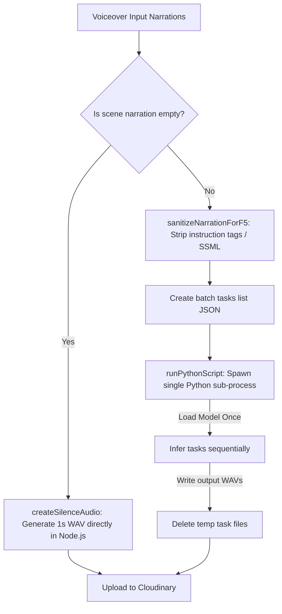

# Advanced Pipeline Features: F5-TTS & AI Scene Queue

> Technical deep-dive into the F5-TTS voice-cloning batch pipeline and the Redis-backed serialized AI scene HTML rendering system.

---

## 1. F5-TTS Voice-Cloning Pipeline

When `VOICEOVER_PROVIDER` is set to `f5`, the pipeline utilizes **F5-TTS**, an open-source neural text-to-speech system, to generate narrations. F5-TTS clones a reference voice from a short sample WAV file.

### High-Level Architecture



### Components and Implementation

#### A. Node.js Service Integration
The core logic resides in [f5-tts-service.ts](file:///c:/Users/susha/OneDrive/Desktop/auto-youtube-channel/workers/voice-over-generation/src/lib/f5/f5-tts-service.ts). It orchestrates:
1. **Config Validation & Paths**: Resolves the reference audio file path (`shorter-better-reference-audio.wav` located in `assets/` or configured via `F5_REFERENCE_AUDIO_PATH`) and the reference transcript text.
2. **Narration Pre-processing**: Cleans up text elements that confuse neural alignment.
3. **Task Assembly**: Pre-configures local file paths (`narration-part-N.wav`) for each scene's audio.

#### B. Text Sanitization Logic
F5-TTS is sensitive to non-pronounceable markers and tags. The service cleanses input text using `sanitizeNarrationForF5()`:
- **Instruction Tags**: Strips tags like `[PAUSE...]` or comments in brackets (`\[.*?\]`).
- **SSML-like Tags**: Strips XML markup (`<[^>]+>`).
- **Hyphenated Words**: Splits hyphens into spaces (e.g., `"low-latency"` $\rightarrow$ `"low latency"`) so F5 does not slur them.
- **Punctuation & Symbols**: Removes formatting markers (`_`, `*`, `~`, `` ` ``) and normalizes long dashes (`–`, `—`) to spaces.
- **Collapsing Punctuation**: Limits repeated exclamation marks or dots (e.g., `"!!!"` $\rightarrow$ `"!"`, `"... "` $\rightarrow$ `". "`).
- **Whitespace**: Shrinks double spaces to single space and trims edges.

#### C. Silence Generation (No-Python Path)
For empty scene narrations (such as hook scenes or intentional visual pauses), spawning Python and running inference is a waste of resources. 
The Node service avoids this entirely by calling `createSilenceAudio()`:
- It creates a raw `Buffer` filled with all-zero PCM samples.
- It adds a standard **44-byte WAV header** (24,000 Hz, 16-bit PCM, Mono).
- It writes the WAV directly to the filesystem in milliseconds.

#### D. Batch Model Inference Execution
Spawning a Python script for *each* individual scene is extremely slow because F5-TTS needs to load PyTorch, weights, and initialize CUDA/CPU resources, which takes around 15–20 seconds per run.

To solve this, the pipeline runs F5-TTS in **batch mode**:
1. The service creates two temporary files in the output directory:
   - A JSON tasks file (`f5_tts_tasks_[rand].json`) listing all non-empty narrations and their respective output file paths:
     ```json
     [
       { "text": "Sanitized scene 1 text...", "outputPath": "/tmp/narration-part-1.wav" },
       { "text": "Sanitized scene 3 text...", "outputPath": "/tmp/narration-part-3.wav" }
     ]
     ```
   - A Python helper script (`f5_tts_batch_[rand].py`).
2. The Node service spawns the Python process (`spawn(pythonBin, [scriptPath])`).
3. The Python script executes the following:
   ```python
   import json
   import soundfile as sf
   from f5_tts.api import F5TTS

   # 1. Load tasks list
   with open(TASKS_PATH, 'r', encoding='utf-8') as f:
       tasks = json.load(f)

   # 2. Instantiate Model ONCE (costly step done once)
   tts = F5TTS()

   # 3. Iterate and infer
   for task in tasks:
       wav, sr, _ = tts.infer(
           ref_file=REFERENCE_AUDIO,
           ref_text=REFERENCE_TEXT,
           gen_text=task['text']
       )
       # 4. Save file
       sf.write(task['outputPath'], wav, sr)
   ```
4. Finally, the temporary script and JSON files are deleted in a `finally` block, and the output WAV clips are uploaded to Cloudinary before local files are cleaned up.

---

## 2. AI Scene Render Queue (`SCENE_RENDER_METHOD=ai`)

When `SCENE_RENDER_METHOD=ai` is enabled, the pipeline generates scene visual layouts by making prompts to Gemini to yield interactive HTML pages rather than compiling HTML canvases locally.

### The Serialization Challenge
During scene rendering, the pipeline runs multiple operations. However, requesting HTML pages from Gemini in parallel will quickly exhaust the Gemini API free-tier rate limits (Requests Per Minute). 
Furthermore, Next.js API endpoints deployed on serverless platforms (like Vercel) have brief timeouts (60 seconds max).

To resolve this, the system implements a **Redis-Backed Serialized Ticket Queue** that:
1. **Serializes Gemini requests**: Guarantees that only **one** scene HTML generation process is actively calling Gemini at any given time.
2. **Throttles calls**: Enforces a strict **22-second cooldown** between successive Gemini calls.
3. **Maintains pipeline parallelism**: Allows the worker to continue with Puppeteer rendering, screenshot capture, FFmpeg compiling, and Cloudinary uploads *while* the 22-second rate-limit sleep runs in the background.

---

### Process Flow & Queue Sequence

```
[ GHA Job Runner ]                   [ Next.js API: /api/generate-scene-html ]                   [ Redis Store ]
        |                                                |                                              |
        |---- 1. POST /api/generate-scene-html --------->|                                              |
        |                                                |---- 2. INCR html_queue:last_enquiry -------->| (Gets ticket #)
        |                                                |                                              |
        |                                                |---- 3. Loop: GET html_queue:turn ----------->|
        |                                                |<--- 4. Returns current active turn ----------|
        |                                                |                                              |
        |                                                |     [ If turn != ticket, wait 2s ]           |
        |                                                |                                              |
        |                                                |==== 5. Active Turn (turn == ticket) =========|
        |                                                |                                              |
        |                                                |---- 6. SETEX html_queue:processing (90s) --->| (Create Lease)
        |                                                |                                              |
        |                                                |---- 7. Invoke Gemini API Model ------------->|
        |                                                |<--- 8. Returns Bespoke Animated HTML --------|
        |                                                |                                              |
        | <-- 9. Returns { html, ticket } --------------|                                              |
        |                                                                                               |
  [ Spawns Background Cooldown Promise (Parallel) ]                                                     |
  [ Starts Puppeteer -> FFmpeg -> Cloudinary ]                                                          |
        |                                                                                               |
        | (Worker rendering takes place in parallel)                                                    |
        |                                                                                               |
        | === 22 Seconds Cooldown Complete =============================================================|
        |                                                                                               |
        | ---- 10. redis.multi(): INCR html_queue:turn & DEL html_queue:processing -------------------->| (Release Lock)
        |                                                                                               |
```

---

### Step-by-Step Implementation Details

#### 1. Server-Side Ticket Acquisition & Loop
In [route.ts](file:///c:/Users/susha/OneDrive/Desktop/auto-youtube-channel/website/app/api/generate-scene-html/route.ts), every POST request performs:
- **`redis.incr("html_queue:last_enquiry")`**: Increments and acquires a monotonic sequential integer (`ticket`).
- **Waiting Loop**:
  ```typescript
  while (true) {
    const turnStr = await redis.get("html_queue:turn");
    const turn = turnStr ? parseInt(turnStr, 10) : 1;

    if (turn === ticket) break; // Our turn to run!
    
    // ... crash recovery checks ...
    await new Promise((resolve) => setTimeout(resolve, 2000));
  }
  ```

#### 2. Automatic Deadlock Recovery
If a server container crashes or network requests abort during a ticket's turn, the queue would freeze forever. The route handler handles recovery dynamically:
- If a ticket sees that the current queue turn is *exactly* its predecessor (`turn === ticket - 1`), it checks if `"html_queue:processing"` lock key exists.
- If it does not exist (meaning the predecessor crashed, or its 90-second lease expired), the current ticket attempts to increment the turn atomically using a **Lua Script**:
  ```typescript
  const recovered = await redis.eval(
    `
    local turn = tonumber(redis.call('get', 'html_queue:turn'))
    local processing = redis.call('exists', 'html_queue:processing')
    local targetTurn = tonumber(ARGV[1])
    if turn == targetTurn and processing == 0 then
      redis.call('incr', 'html_queue:turn')
      return 1
    end
    return 0
    `,
    0,
    String(ticket - 1)
  );
  ```
- If `recovered === 1`, it prints a recovery event, advances the turn, and enters its own active state.

#### 3. Request Lease Creation
Once active, it creates a processing lease to tell other tickets it is running:
- `redis.set("html_queue:processing", ticket, "EX", 90)` sets the lock with a 90-second safety timeout.

#### 4. Gemini Invocation & Fast Return
- The API handler calls `SceneHtmlGenerationService` to prompt Gemini.
- As soon as the HTML is generated, the API endpoint returns `{ html, ticket }` to the worker **immediately**. It does *not* sleep on the server side (to avoid Next.js/Vercel timeout limits).

#### 5. Client-Side Background Cooldown (Parallelism Preservation)
The worker [actios-to-clips.ts](file:///c:/Users/susha/OneDrive/Desktop/auto-youtube-channel/workers/video-scene-renderer/src/lib/actios-to-clips.ts) receives the response. To prevent exhausting Gemini's RPM limit, it enforces a 22-second delay. But rather than doing this synchronously (which would stall the rendering machine), it splits the flow:
1. **Background Cleanup Promise**:
   It executes an asynchronous cleanup loop pushed into `this.pendingCleanups`:
   ```typescript
   const cleanupPromise = (async () => {
     // 1. Sleep for 22s in the background
     await new Promise((resolve) => setTimeout(resolve, 22000));
     
     // 2. Connect to Redis
     const redis = new Redis(process.env.REDIS_URL!);
     
     // 3. Atomically increment turn and release the lock using a Redis transaction
     const pipeline = redis.multi();
     pipeline.incr("html_queue:turn");
     pipeline.del("html_queue:processing");
     await pipeline.exec();
     
     await redis.quit();
   })();
   this.pendingCleanups.push(cleanupPromise);
   ```
2. **Main Thread Rendering**:
   Simultaneously, the main execution thread immediately triggers `HtmlToVideoService.render()` on the HTML content:
   - Spawns Puppeteer.
   - Takes screenshots frame-by-frame.
   - Encodes frame sequences into an MP4 clip via FFmpeg.
   - Uploads the scene clip to Cloudinary.
   - Deletes temporary local files.
   - Moves to the next scene.

3. **Coordination**:
   Because rendering and uploading a scene typically takes 15–30 seconds, the 22-second background cooldown completes *while the worker is busy rendering*. This overlaps rate-limiting sleep with compute-intensive work.
   
4. **Final Sync**:
   Before `renderScenes()` returns, it executes `await Promise.all(this.pendingCleanups)`. This blocks script completion until all pending cooldowns have expired and the Redis keys have been safely incremented, guaranteeing no key leaks.

#### 6. Multi-Runner Serialization
Because the Redis connection is shared across all GitHub Actions VM runners, this rate-limiting mechanism works perfectly even if multiple jobs (e.g., long-form rendering and multiple Shorts matrix rendering instances) run in parallel across separate VMs. Each runner is allocated a unique global ticket index, serializing the Gemini calls globally while running local Chromium renderings independently.
