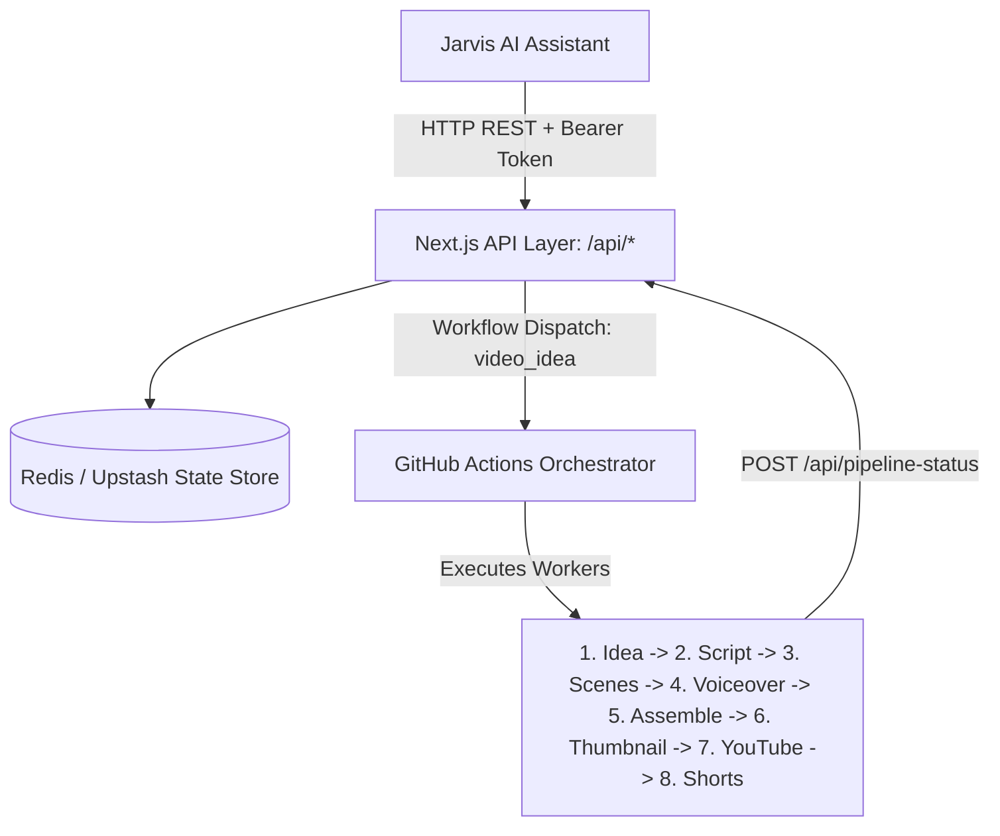

# Jarvis Integration Specification & Direct API Reference

> **Target Audience:** Autonomous AI Assistants (Jarvis), Agentic Toolkits, and Developers.  
> **Repository:** `auto-youtube-channel`  
> **Integration Mode:** Direct HTTP REST API (No npm installation required)  
> **Last Updated:** 2026-09-12  

---

## 1. System Architecture Overview

`auto-youtube-channel` is an autonomous AI-driven pipeline that generates, voices, visualizes, assembles, and publishes daily YouTube videos and Shorts without manual intervention.



### Jarvis Operating Principles
- **Authentication:** Jarvis authenticates to every endpoint using `x-jarvis-key` or `Authorization: Bearer <JARVIS_API_KEY>`.
- **Direct Integration:** Jarvis makes direct standard HTTP calls (Node `fetch`, Python `requests`, or curl) — no local npm package install or publishing is required.
- **Context Awareness (Read):** Read current render status, pipeline errors, remaining ideas backlog, curriculum series progress, YouTube channel performance, and publishing timetable.
- **Autonomous Actions (Write):** Trigger video production with a custom topic idea, rerun failed steps, add/reorder ideas in the queue, create new series, update schedules, and draft scripts or thumbnails on demand.

---

## 2. Authentication & Base URL

### 2.1 Base URL
- **Local Dev:** `http://localhost:3000`
- **Production:** Configured on Vercel (e.g. `https://your-app.vercel.app`)

### 2.2 Standard Request Headers
Jarvis must send these headers with every request:
```http
Content-Type: application/json
Accept: application/json
Cache-Control: no-cache
x-jarvis-key: YOUR_JARVIS_API_KEY
```
*(Alternatively: `Authorization: Bearer YOUR_JARVIS_API_KEY`)*

---

## 3. Context Awareness Endpoints (Read / Observability)

---

### 3.1. Pipeline Status & Real-time Diagnostics
Fetches real-time status of the active or most recent video generation run, including job stages, media URLs, scheduled Shorts, and failure error messages.

- **Endpoint:** `GET /api/pipeline-status`
- **Headers:** `x-jarvis-key: <JARVIS_API_KEY>`
- **Response (`200 OK`):**
```json
{
  "ok": true,
  "status": {
    "overallStatus": "running", // "running" | "success" | "failure"
    "ranAt": "2026-09-12T01:00:00.000Z",
    "runId": "1234567890",
    "videoId": "video-1741740000",
    "videoTitle": "Why Redis is Misused in Production",
    "youtubeId": "dQw4w9WgXcQ",
    "videoUrl": "https://res.cloudinary.com/.../final_video.mp4",
    "thumbnailUrl": "https://res.cloudinary.com/.../thumbnail.jpg",
    "description": "Video description with timestamps...",
    "errorSummary": null, // String with failure explanation if overallStatus is "failure"
    "sceneUrls": [
      "https://res.cloudinary.com/.../scene-0.mp4"
    ],
    "voiceoverUrls": [
      "https://res.cloudinary.com/.../voice-0.wav"
    ],
    "sceneNarrations": [
      "Redis is often thought of as just a cache..."
    ],
    "shortHooks": [
      "Redis is NOT just a cache"
    ],
    "shortCaptions": [
      "Stop treating Redis like a simple KV store! 🚀 #redis #backend"
    ],
    "ideasAdded": ["Why Redis is Misused in Production"],
    "shorts": [
      {
        "shortIndex": 0,
        "shortId": "video-1741740000-short-0",
        "youtubeId": "AbCdEf123",
        "videoUrl": "https://res.cloudinary.com/.../short-0.mp4",
        "scheduledPublishTime": "2026-09-12T11:00:00.000Z",
        "rank": 0
      }
    ],
    "jobs": {
      "populateIdeas": "success",
      "generateScript": "success",
      "renderScenes": "running",
      "generateVoiceover": "pending",
      "assembleLongForm": "pending",
      "generateThumbnail": "pending",
      "uploadYoutube": "pending",
      "shortsProcessing": "pending"
    }
  }
}
```

---

### 3.2. Channel Video Generation History
Returns the archive of past video generation pipeline runs.

- **Endpoint:** `GET /api/history?limit=10`
- **Query Parameters:** `limit` (optional, default: 10, max: 50)
- **Response (`200 OK`):**
```json
{
  "ok": true,
  "count": 2,
  "runs": [
    {
      "videoId": "video-1741740000",
      "videoTitle": "Why Redis is Misused in Production",
      "overallStatus": "success",
      "youtubeId": "dQw4w9WgXcQ",
      "videoUrl": "https://res.cloudinary.com/.../video-1.mp4",
      "thumbnailUrl": "https://res.cloudinary.com/.../thumb-1.jpg",
      "ranAt": "2026-09-12T01:00:00.000Z",
      "runId": "1234567890",
      "errorSummary": null
    },
    {
      "videoId": "video-1741650000",
      "videoTitle": "How Database Indexing Works",
      "overallStatus": "success",
      "youtubeId": "aBcDeFg1234",
      "videoUrl": "https://res.cloudinary.com/.../video-2.mp4",
      "thumbnailUrl": "https://res.cloudinary.com/.../thumb-2.jpg",
      "ranAt": "2026-09-11T01:00:00.000Z",
      "runId": "1234567880",
      "errorSummary": null
    }
  ]
}
```

---

### 3.3. YouTube Channel Analytics
Retrieves live YouTube channel overview and recent video engagement statistics.

- **Endpoint:** `GET /api/analytics?daysBack=30&limit=10`
- **Query Parameters:**
  - `daysBack` (optional, default: 30, max: 90)
  - `limit` (optional, default: 10, max: 50)
- **Response (`200 OK`):**
```json
{
  "ok": true,
  "channel": {
    "title": "Why This In Tech",
    "subscriberCount": 1250,
    "viewCount": 85400,
    "videoCount": 24
  },
  "videoCount": 10,
  "recentVideos": [
    {
      "videoId": "dQw4w9WgXcQ",
      "title": "Why Redis is Misused in Production",
      "views": 4200,
      "impressions": 38000,
      "ctr": 5.4,
      "averageViewDuration": 210,
      "averageViewPercentage": 64.2,
      "comments": 35,
      "likes": 290,
      "publishedAt": "2026-09-11T13:00:00Z",
      "isShort": false
    }
  ]
}
```

---

### 3.4. Content Ideas Queue Backlog
Fetches the ordered list of topic ideas waiting in the pipeline.

- **Endpoint:** `GET /api/ideas-queue`
- **Response (`200 OK`):**
```json
{
  "ok": true,
  "ideas": [
    "Why Event-Driven Architecture Fails at Scale",
    "How Database Indexing Actually Works in B-Trees",
    "The Hidden Cost of Microservices"
  ],
  "count": 3
}
```

---

### 3.5. Educational Series & Curriculum
Retrieves all multi-part video series, tracking learning goals, published history, and queued episodes.

- **Endpoint:** `GET /api/series`
- **Response (`200 OK`):**
```json
{
  "ok": true,
  "series": [
    {
      "id": "system-design-mastery",
      "title": "System Design Mastery",
      "learningGoal": "Master backend architecture patterns from first principles",
      "status": "active",
      "version": 2,
      "priority": 1,
      "uploadCount": 4,
      "lastUploadTimestamp": "2026-09-11T13:00:00.000Z",
      "learningQueue": [
        {
          "episodeId": "ep-5",
          "topic": "Consistent Hashing & Virtual Nodes",
          "learningObjective": "Understand ring topologies and balance distribution",
          "difficulty": "intermediate",
          "estimatedDuration": "8m",
          "prerequisites": ["Distributed Caching"],
          "status": "pending"
        }
      ],
      "history": [
        {
          "episodeId": "ep-4",
          "videoId": "video-1741650000",
          "topic": "Distributed Caching"
        }
      ]
    }
  ]
}
```

---

### 3.6. Publishing Timetable
Returns the configured daily publishing schedule in Indian Standard Time (IST).

- **Endpoint:** `GET /api/schedule-times`
- **Response (`200 OK`):**
```json
{
  "ok": true,
  "shortsTimes": ["16:30", "18:00", "20:00", "12:00", "14:00"],
  "longFormTime": "18:30"
}
```

---

### 3.7. Pipeline Configuration Settings
Fetches active TTS voiceover provider and visual scene render method.

- **Endpoint:** `GET /api/settings`
- **Response (`200 OK`):**
```json
{
  "ok": true,
  "voiceoverProvider": "gemini", // "gemini" | "f5"
  "sceneRenderMethod": "code"    // "code" | "ai"
}
```

---

## 4. Action Endpoints (Write / Control)

---

### 4.1. Trigger Video Pipeline with Custom Idea
Triggers the GitHub Actions pipeline workflow. Supports passing a custom topic directly, or generating the next idea from the queue if omitted.

- **Endpoint:** `POST /api/trigger-youtube`
- **Request Body:**
```json
{
  "videoIdea": "Why Zero-Copy Networking Boosts Kafka Throughput"
}
```
*(Leave `videoIdea` empty or omit body to produce the next topic from the queue).*
- **Response (`200 OK`):**
```json
{
  "success": true,
  "message": "Pipeline workflow dispatched successfully",
  "videoIdea": "Why Zero-Copy Networking Boosts Kafka Throughput"
}
```

---

### 4.2. Retry Failed Pipeline Jobs
Retries only failed steps of a GitHub Actions run without reprocessing completed steps.

- **Endpoint:** `POST /api/rerun-failed-jobs`
- **Request Body:**
```json
{
  "runId": 1234567890
}
```
*(Leave `runId` omitted to automatically retry the most recent failed run).*
- **Response (`200 OK`):**
```json
{
  "ok": true,
  "message": "Successfully triggered rerun for failed jobs in run #1234567890",
  "runId": 1234567890
}
```

---

### 4.3. Manage Content Ideas Queue
Allows Jarvis to add, edit, reorder, or remove ideas in the queue.

- **Endpoint:** `POST /api/ideas-queue`

#### Add an Idea:
```json
{
  "action": "add",
  "idea": "Why Single-Threaded Event Loops Outperform Multi-Threading"
}
```

#### Reorder / Prioritize an Idea:
```json
{
  "action": "move",
  "index": 2,
  "newIndex": 0
}
```

#### Remove an Idea:
```json
{
  "action": "remove",
  "index": 1
}
```

#### Clear Queue:
```json
{
  "action": "clear"
}
```

- **Response (`200 OK`):** Returns updated `{ "ok": true, "ideas": [...], "count": N }`.

---

### 4.4. Series Management
Allows Jarvis to create, pause, or resume episodic video series.

- **Endpoint:** `POST /api/series`

#### Create Series:
```json
{
  "action": "create",
  "id": "rust-internals",
  "title": "Rust Internals & Memory Model",
  "learningGoal": "Master borrow checking, lifetimes, and unsafe code"
}
```

#### Pause / Resume Series:
```json
{
  "action": "updateStatus",
  "id": "rust-internals",
  "status": "paused" // "active" | "paused"
}
```

---

### 4.5. Initialize AI Series Curriculum
Prompts the SeriesManager AI to draft a structured multi-episode learning syllabus.

- **Endpoint:** `POST /api/series/create`
- **Request Body:**
```json
{
  "id": "kubernetes-internals",
  "title": "Kubernetes Architecture from the Inside",
  "learningGoal": "Understand etcd consistency, kube-controller-manager, and CNI plugins"
}
```
- **Response (`200 OK`):**
```json
{
  "success": true,
  "message": "Series kubernetes-internals initialized."
}
```

---

### 4.6. Update Publishing Timetable
Updates scheduled release times in IST.

- **Endpoint:** `POST /api/schedule-times`
- **Request Body:**
```json
{
  "shortsTimes": ["07:00", "08:30", "12:15", "17:00", "21:00"],
  "longFormTime": "19:00"
}
```

---

### 4.7. Update Engine Settings
- **Endpoint:** `POST /api/settings`
- **Request Body:**
```json
{
  "voiceoverProvider": "gemini", // "gemini" | "f5"
  "sceneRenderMethod": "code"    // "code" | "ai"
}
```

---

### 4.8. On-Demand Script & Storyboard Preview
Generates a script without compiling a video, allowing Jarvis to review or edit scenes.

- **Endpoint:** `POST /api/generate-script`
- **Request Body:**
```json
{
  "videoIdea": "Why SQLite is All You Need for Small SaaS",
  "sceneRenderMethod": "code"
}
```
- **Response (`200 OK`):** Full `{ "script": { "title": "...", "scenes": [...], "shorts": [...] } }`.

---

### 4.9. On-Demand Thumbnail Generation
Generates a stylized thumbnail via AI and uploads it to Cloudinary.

- **Endpoint:** `POST /api/generate-thumbnail`
- **Request Body:**
```json
{
  "videoId": "preview-vid-1",
  "title": "Why SQLite Beats PostgreSQL",
  "narration": "Explaining embedded database storage",
  "tags": ["sqlite", "database"],
  "style": "minimal"
}
```

---

## 5. Ready-to-Use LLM Tool / Function Calling Schemas

Register these function schemas directly into Jarvis's LLM engine (compatible with OpenAI function calling, Gemini Tools, and Anthropic Tool definitions):

```json
[
  {
    "name": "channel_get_pipeline_status",
    "description": "Checks the real-time execution status of the automated YouTube channel pipeline, including active job progress, generated video URLs, YouTube IDs, and scheduled shorts.",
    "parameters": {
      "type": "object",
      "properties": {}
    }
  },
  {
    "name": "channel_trigger_video_generation",
    "description": "Triggers the automated video generation pipeline immediately via GitHub Actions.",
    "parameters": {
      "type": "object",
      "properties": {
        "videoIdea": {
          "type": "string",
          "description": "Optional custom topic idea. If omitted, the next idea from the queue is used."
        }
      }
    }
  },
  {
    "name": "channel_retry_failed_jobs",
    "description": "Reruns only the failed steps of the latest or specified pipeline run without starting from scratch.",
    "parameters": {
      "type": "object",
      "properties": {
        "runId": {
          "type": "string",
          "description": "Optional GitHub Actions workflow run ID. If omitted, retries the latest failed run."
        }
      }
    }
  },
  {
    "name": "channel_get_history",
    "description": "Fetches the archive of past video generation runs, including video URLs, YouTube IDs, and dates.",
    "parameters": {
      "type": "object",
      "properties": {
        "limit": {
          "type": "integer",
          "description": "Number of runs to retrieve (default: 10, max: 50)"
        }
      }
    }
  },
  {
    "name": "channel_get_analytics",
    "description": "Retrieves YouTube channel overview statistics and recent video metrics (views, CTR, retention, likes).",
    "parameters": {
      "type": "object",
      "properties": {
        "daysBack": {
          "type": "integer",
          "description": "Time window in days for metrics (default: 30)"
        },
        "limit": {
          "type": "integer",
          "description": "Number of videos to analyze (default: 10)"
        }
      }
    }
  },
  {
    "name": "channel_get_ideas_queue",
    "description": "Fetches the list of upcoming video topic ideas currently waiting in the backlog queue.",
    "parameters": {
      "type": "object",
      "properties": {}
    }
  },
  {
    "name": "channel_add_video_idea",
    "description": "Adds a new video topic idea to the queue for automated production.",
    "parameters": {
      "type": "object",
      "properties": {
        "idea": {
          "type": "string",
          "description": "Title or topic of the video idea (e.g. 'How Zero-Copy Networking Works')."
        }
      },
      "required": ["idea"]
    }
  },
  {
    "name": "channel_reorder_video_idea",
    "description": "Moves a video idea to a new position in the backlog queue.",
    "parameters": {
      "type": "object",
      "properties": {
        "index": {
          "type": "integer",
          "description": "Current 0-based index of the idea"
        },
        "newIndex": {
          "type": "integer",
          "description": "Target 0-based index of the idea (0 is highest priority)"
        }
      },
      "required": ["index", "newIndex"]
    }
  },
  {
    "name": "channel_get_series",
    "description": "Retrieves all educational series, tracking completed episodes and upcoming syllabus topics.",
    "parameters": {
      "type": "object",
      "properties": {}
    }
  },
  {
    "name": "channel_create_series",
    "description": "Creates a new multi-episode educational video series with an AI-curated curriculum.",
    "parameters": {
      "type": "object",
      "properties": {
        "id": {
          "type": "string",
          "description": "Unique slug ID (e.g., 'distributed-systems-101')"
        },
        "title": {
          "type": "string",
          "description": "Series title"
        },
        "learningGoal": {
          "type": "string",
          "description": "High-level learning objective of the series"
        }
      },
      "required": ["id", "title", "learningGoal"]
    }
  },
  {
    "name": "channel_update_schedule",
    "description": "Updates publishing times in IST for long-form videos and daily Shorts.",
    "parameters": {
      "type": "object",
      "properties": {
        "longFormTime": {
          "type": "string",
          "description": "24h HH:MM IST time string (e.g., '18:30')"
        },
        "shortsTimes": {
          "type": "array",
          "items": { "type": "string" },
          "description": "Array of exactly 5 time strings in 24h HH:MM format (e.g., ['07:00','08:30','12:15','17:00','21:00'])"
        }
      }
    }
  }
]
```
